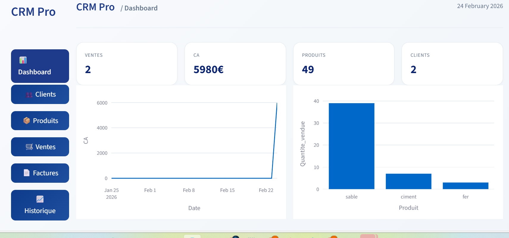

# CRM PRO - Application de Gestion Commerciale


## 📋 Table des matières
- [Aperçu](#aperçu)
- [Fonctionnalités](#fonctionnalités)
- [Capture d'écran](#capture-décran)
- [Installation](#installation)
- [Utilisation](#utilisation)
- [Structure du projet](#structure-du-projet)
- [Technologies utilisées](#technologies-utilisées)
- [Contribution](#contribution)
- [Licence](#licence)
- [Contact](#contact)

## 🎯 Aperçu

**CRM Pro** est une application de gestion commerciale professionnelle développée par Abdoulaye Diop. Elle permet de gérer efficacement vos clients, produits, ventes et factures dans une interface moderne et intuitive.

### ✨ Fonctionnalités principales

- **📊 Tableau de bord** : Visualisez vos statistiques clés (CA, ventes, clients)
- **👥 Gestion des clients** : Ajoutez, modifiez et consultez vos clients
- **📦 Gestion des produits** : Gérez votre catalogue et suivez les stocks
- **🛒 Gestion des ventes** : Enregistrez les ventes avec panier dynamique
- **📄 Génération de factures** : Créez des factures PDF professionnelles
- **📈 Historique** : Consultez l'historique complet des ventes
- **⚠️ Alertes stock** : Recevez des alertes pour les produits en stock faible

## 📸 Capture d'écran


*Interface principale du tableau de bord*

## 🚀 Installation

### Prérequis
- Python 3.8 ou supérieur
- pip (gestionnaire de paquets Python)

### Installation standard

```bash
# 1. Clonez le dépôt
git clone https://github.com/ABDOULAYEDIOP150/CRM.git
cd CRM

# 2. Créez un environnement virtuel (recommandé)
python -m venv venv

# 3. Activez l'environnement virtuel
# Sur Windows :
venv\Scripts\activate
# Sur Mac/Linux :
source venv/bin/activate

# 4. Installez les dépendances
pip install -r requirements.txt

# 5. Lancez l'application
streamlit run app_crm.py

