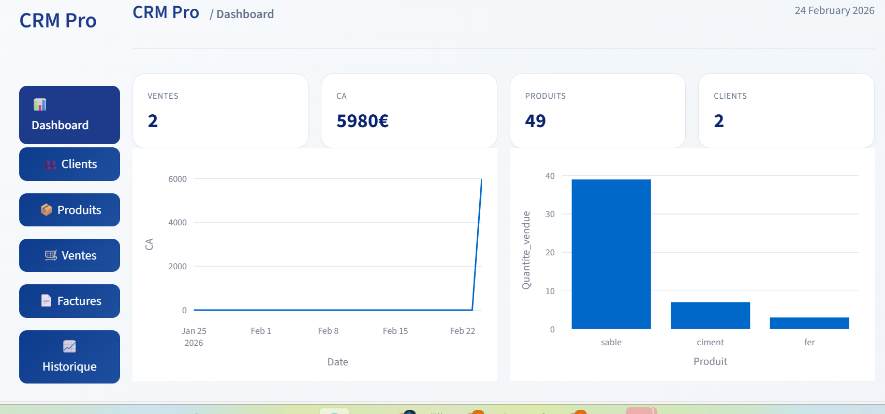

# 🚀 CRM PRO - Application de Gestion Commerciale & Données Clients


---

## 🎯 Aperçu

**CRM Pro** est une application de gestion commerciale et de pilotage des données clients, développée dans une logique proche des outils CRM professionnels (type Salesforce, Coheris).

L’objectif est de centraliser, structurer et exploiter les données clients afin d’améliorer le suivi commercial, la prise de décision et la performance globale.

👉 Ce projet s’inscrit dans une démarche de :

* structuration des données CRM
* pilotage d’activité commerciale
* support à la décision via indicateurs

---

## 📸 Capture d’écran



*Exemple : tableau de bord et interface de gestion (clients, produits, ventes)*

👉 L’application comporte plusieurs modules :

* Dashboard (indicateurs clés)
* Gestion des clients
* Gestion des produits
* Gestion des ventes
* Facturation

---

## 💡 Problématique métier

Dans de nombreuses organisations, les données clients sont :

* dispersées (Excel, outils multiples)
* peu structurées
* difficilement exploitables

👉 CRM Pro répond à ces enjeux en proposant :

* une base de données centralisée
* une vision 360° du client
* des indicateurs de performance en temps réel

---

## 🧠 Fonctionnalités principales

### 📊 Pilotage & Reporting

* Tableau de bord interactif (CA, ventes, clients actifs)
* Suivi des performances commerciales
* Indicateurs clés pour aide à la décision

### 👥 Gestion des données clients

* Création, modification et consultation des clients
* Structuration des données clients (contacts, historique)
* Vision globale du portefeuille client

### 📦 Gestion des produits

* Catalogue produits
* Suivi des stocks
* Alertes automatiques en cas de seuil critique

### 🛒 Gestion des ventes

* Enregistrement des ventes
* Gestion de panier dynamique
* Historique complet des transactions

### 📄 Facturation

* Génération automatique de factures PDF
* Archivage des transactions

### 🔄 Logique CRM

* Suivi des interactions commerciales
* Historisation des actions
* Base exploitable pour marketing ou analyse

---

## 🏗️ Architecture & Structure du projet

```bash
CRM/
│── app_crm.py              # Application principale Streamlit
│── requirements.txt        # Dépendances
│── data/                   # Données (clients, ventes, produits)
│── modules/                # Logique métier (gestion CRM)
│── assets/                 # Images / UI
```

---

## 🧩 Modélisation des données

Le projet repose sur une structuration des données proche des CRM :

* **Clients** : informations personnelles, historique
* **Produits** : catalogue et stock
* **Ventes** : transactions liées aux clients
* **Factures** : documents générés

👉 Cette modélisation permet :

* une meilleure exploitation des données
* une analyse du parcours client
* une base pour marketing relationnel

---

## ⚙️ Technologies utilisées

* **Python** (logique applicative)
* **Streamlit** (interface utilisateur)
* **Pandas** (traitement des données)
* **SQL / CSV** (stockage des données)
* **ReportLab / PDF** (génération de factures)

---

## 🔄 Logique projet (approche applicative)

Ce projet a été conçu dans une logique de :

* gestion d’un système applicatif CRM
* évolution progressive des fonctionnalités
* adaptation aux besoins métier
* amélioration continue

👉 Il simule le rôle de :
**Responsable applicatif / Data orienté CRM**

---

## 🚀 Installation

### Prérequis

* Python 3.8+
* pip

### Étapes

```bash
git clone https://github.com/ABDOULAYEDIOP150/CRM.git
cd CRM

python -m venv venv

# Activation
# Windows
venv\Scripts\activate
# Mac/Linux
source venv/bin/activate

pip install -r requirements.txt

streamlit run app_crm.py
```

---

## ▶️ Utilisation

1. Accéder au tableau de bord
2. Ajouter des clients / produits
3. Enregistrer des ventes
4. Générer des factures
5. Analyser les performances

---

## 📈 Perspectives d’amélioration

* Intégration d’une base SQL (PostgreSQL / MySQL)
* Ajout d’API pour interconnexion (approche SI)
* Module de marketing automation (emailing)
* Gestion des utilisateurs / rôles
* Intégration RGPD (gestion consentement)

---

## 🤝 Contribution

Les contributions sont les bienvenues :

* amélioration des fonctionnalités
* optimisation technique
* ajout de modules CRM

---

## 📄 Licence

Projet sous licence MIT

---

## 📬 Contact

**Abdoulaye Diop**
📧 [diop.abdoulaye.stats@gmail.com](mailto:diop.abdoulaye.stats@gmail.com)
🔗 LinkedIn : https://www.linkedin.com/in/abdoulaye-diop-71467b361/

---
